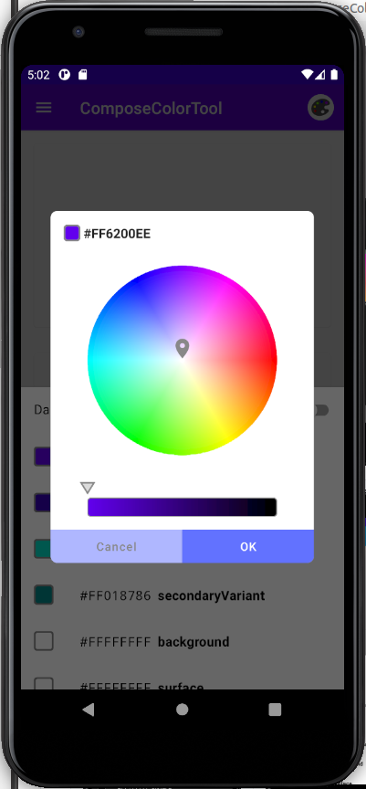
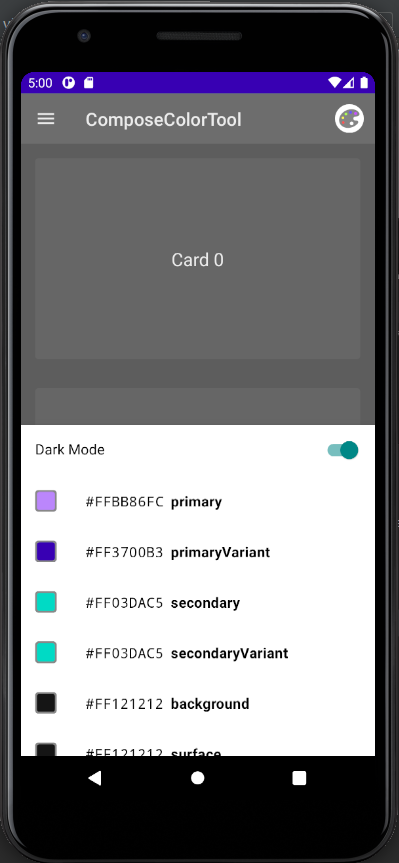

# ComposeColorTool

## Abstraction
This is a Color Theme Tool for Jetpack Compose

## Motivation
Want to know which color settings actually affect to which views.

## Images
|      |      |      |
| ---- | ---- | ---- |
|  |  |  |
|  |  |  |

## TODO
- [ ] fix color of color palette and bottom sheet
  - not to be affected by color settings
- [ ] add more view templates
- [x] add license page
  - [ ] use nav controller

## License
```
Copyright 2020 The Android Open Source Project

Licensed under the Apache License, Version 2.0 (the "License");
you may not use this file except in compliance with the License.
You may obtain a copy of the License at

    https://www.apache.org/licenses/LICENSE-2.0

Unless required by applicable law or agreed to in writing, software
distributed under the License is distributed on an "AS IS" BASIS,
WITHOUT WARRANTIES OR CONDITIONS OF ANY KIND, either express or implied.
See the License for the specific language governing permissions and
limitations under the License.
```
